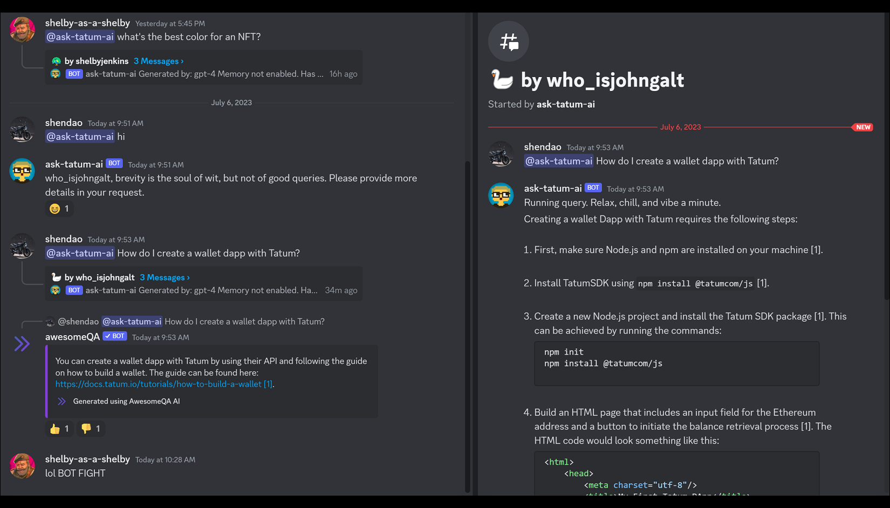

<!-- Improved compatibility of back to top link: See: https://github.com/othneildrew/Best-README-Template/pull/73 -->

<!--
*** Thanks for checking out the Best-README-Template. If you have a suggestion
*** that would make this better, please fork the repo and create a pull request
*** or simply open an issue with the tag "enhancement".
*** Don't forget to give the project a star!
*** Thanks again! Now go create something AMAZING! :D
-->

<!-- PROJECT SHIELDS -->
<!--
*** I'm using markdown "reference style" links for readability.
*** Reference links are enclosed in brackets [ ] instead of parentheses ( ).
*** See the bottom of this document for the declaration of the reference variables
*** for contributors-url, forks-url, etc. This is an optional, concise syntax you may use.
*** https://www.markdownguide.org/basic-syntax/#reference-style-links
-->
[![Contributors][contributors-shield]][contributors-url]
[![Forks][forks-shield]][forks-url]
[![Stargazers][stars-shield]][stars-url]
[![Issues][issues-shield]][issues-url]
[![MIT License][license-shield]][license-url]
[![LinkedIn][linkedin-shield]][linkedin-url]

<!-- PROJECT LOGO
 

  

<h3 align="center">project_title</h3>

  

    project_description
     
    <a href="https://github.com/ShelbyJenkins/shelby-as-a-service"><strong>Explore the docs »</strong></a>
     
     
    <a href="https://github.com/ShelbyJenkins/shelby-as-a-service">View Demo</a>
    ·
    <a href="https://github.com/ShelbyJenkins/shelby-as-a-service/issues">Report Bug</a>
    ·
    <a href="https://github.com/ShelbyJenkins/shelby-as-a-service/issues">Request Feature</a>
  

 -->

<!-- TABLE OF CONTENTS -->

  
Table of Contents

  <ol>
    <li>
      <a href="#about-the-project">About The Project</a>
      <ul>
        <li><a href="#built-with">Built With</a></li>
      </ul>
    </li>
    <li>
      <a href="#getting-started">Getting Started</a>
      <ul>
        <li><a href="#prerequisites">Prerequisites</a></li>
        <li><a href="#installation">Installation</a></li>
      </ul>
    </li>
    <li><a href="#usage">Usage</a></li>
    <li><a href="#roadmap">Roadmap</a></li>
    <li><a href="#contributing">Contributing</a></li>
    <li><a href="#license">License</a></li>
    <li><a href="#contact">Contact</a></li>
    <li><a href="#acknowledgments">Acknowledgments</a></li>
  </ol>

<!-- ABOUT THE PROJECT -->

## GPT + your docs. Pre-built and configured bots. Just add API keys.

    
    

### Features

The 'hello world' of the AI world is question and answers on docs. But there is difference between a PoC notebook and something actually useful. This project has been used successfully in production for a ~2 months and has happily answered hundreds of user queries.
* Easy step-by-step guides to deploy Discord and Slack bots to production
* `index_service` automatically scrapes, processes, chunks, and upserts to documents to vector index. Supports:
  * generic websites
  * gitbooks
  * sitemaps
  * OpenAPI specs
* Superior Document retrieval with keyword generation, metadata filtering, doc relevancy checks, and document pre/post processing
* No configuration required, but you can configure anything easily; from the length of response from GPT to the tone of the response. 
  * An example of a setting to play with is the main prompt that ends with, `Be kind, and feel free to be humourous if you have a relevant joke.`

(<a href="#readme-top">back to top</a>)

<!-- GETTING STARTED -->
## Getting Started

### Step-by-step guide
1. [Install Shelby-as-a-Service](https://github.com/ShelbyJenkins/shelby-as-a-service/blob/main/documentation/1_installation.md)
2. [Initial local setup](https://github.com/ShelbyJenkins/shelby-as-a-service/blob/main/documentation/2_local_setup.md)
3. [Document index configuration](https://github.com/ShelbyJenkins/shelby-as-a-service/blob/main/documentation/3_document_index_configuration.md)
4. Special steps for:
   1. [Deploying to Discord](https://github.com/ShelbyJenkins/shelby-as-a-service/blob/main/documentation/4a_deploying_to_discord.md)
   2. [Deploying to Slack](https://github.com/ShelbyJenkins/shelby-as-a-service/blob/main/documentation/4b_deploying_to_slack.md)

### Prerequisites

You will need and API key for the following services:

Free:
* Discord -> https://discord.com/developers/docs/intro
* or Slack -> https://api.slack.com/apps
* Pinecone -> https://www.pinecone.io/
* Github -> https://github.com/
* Docker -> https://www.docker.com/

Paid:
* OpenAI API (GPT-3.5 is tenable) -> https://platform.openai.com/overview
* Compute providers:
  * Stackpath -> https://www.stackpath.com/
  * More providers TBD

(<a href="#readme-top">back to top</a>)

<!-- ROADMAP -->
## Roadmap

* Better Retrival from technical keywords: Keyword and plaintext search may improve retrival vs pure semantic search.
* Non-deterministic function calling on open API specs: Minificication and indexing of API specs done. When presented an index of API endpoints and a user request GPT can select the correct API endpoint to call. I just need to implement building the API call.
* Github repos as a document source: Crucial.
* Memory: ChatGPT has memory which preserves context in between requests and responses. Currently memory is not implemented with the bots which can be frustrating when it comes to asking follow ups. 
  

(<a href="#readme-top">back to top</a>)

<!-- CONTRIBUTING -->
## Contributing

I would love any help adding features!

If you have a suggestion that would make this better, please fork the repo and create a pull request. You can also simply open an issue with the tag "enhancement".
Don't forget to give the project a star! Thanks again!

1. Fork the Project
2. Create your Feature Branch (`git checkout -b feature/AmazingFeature`)
3. Commit your Changes (`git commit -m 'Add some AmazingFeature'`)
4. Push to the Branch (`git push origin feature/AmazingFeature`)
5. Open a Pull Request

(<a href="#readme-top">back to top</a>)

<!-- LICENSE -->
## License

Distributed under the MIT License. See `LICENSE.txt` for more information.

(<a href="#readme-top">back to top</a>)

<!-- CONTACT -->
## Contact

Shelby Jenkins - Here or Linkedin https://www.linkedin.com/company/shelby-as-a-service/

Project Link: [https://github.com/ShelbyJenkins/shelby-as-a-service](https://github.com/ShelbyJenkins/shelby-as-a-service)

(<a href="#readme-top">back to top</a>)

<!-- MARKDOWN LINKS & IMAGES -->
<!-- https://www.markdownguide.org/basic-syntax/#reference-style-links -->
[contributors-shield]: https://img.shields.io/github/contributors/shelby-as-a/shelby-as-a-service.svg?style=for-the-badge
[contributors-url]: https://github.com/shelby-as-a/shelby-as-a-service/graphs/contributors
[forks-shield]: https://img.shields.io/github/forks/shelby-as-a/shelby-as-a-service.svg?style=for-the-badge
[forks-url]: https://github.com/shelby-as-a/shelby-as-a-service/network/members
[stars-shield]: https://img.shields.io/github/stars/shelby-as-a/shelby-as-a-service.svg?style=for-the-badge
[stars-url]: https://github.com/shelby-as-a/shelby-as-a-service/stargazers
[issues-shield]: https://img.shields.io/github/issues/shelby-as-a/shelby-as-a-service.svg?style=for-the-badge
[issues-url]: https://github.com/shelby-as-a/shelby-as-a-service/issues
[license-shield]: https://img.shields.io/github/license/shelby-as-a/shelby-as-a-service.svg?style=for-the-badge
[license-url]: https://github.com/shelby-as-a/shelby-as-a-service/blob/master/LICENSE.txt
[linkedin-shield]: https://img.shields.io/badge/-LinkedIn-black.svg?style=for-the-badge&logo=linkedin&colorB=555
[linkedin-url]: https://www.linkedin.com/company/shelby-as-a-service/

[discord-screenshot]: documentation/discord-example.png
[slack-screenshot]: documentation/slack-example.png
